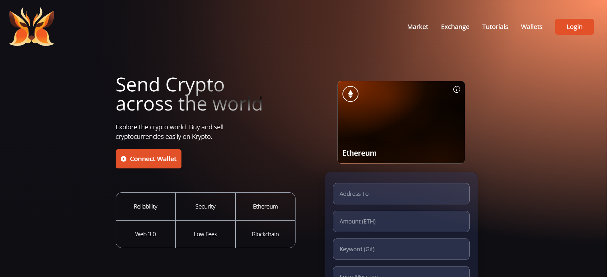

# Project Web 3.0

# Introduction

- The first blockchain website built using Web 3.0 methodologies, Solidity, and Metamask. Users can track transaction history.

# My Projects

    

 

# Using

- Vercel: Hosting Services
- Tailwind CSS: Format Style
- React: Front-End
- Solidity, Metamask
- Git & Github: Version Control

 

# Install, Run
- yarn || npm install
- yarn dev || npm run dev

# About Me

    <a href="https://ttv-tranthuyvy-cv.vercel.app/">
      <h6>https://ttv-tranthuyvy-cv.vercel.app</h6>
    </a>

[website]: https://project-web3-pink.vercel.app/
